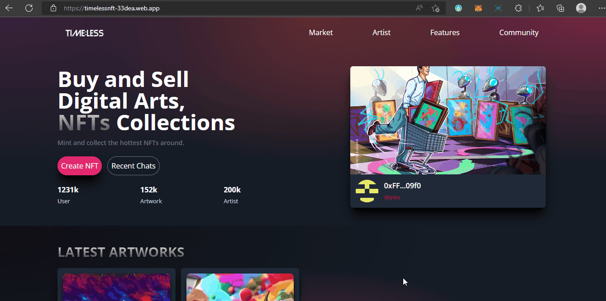
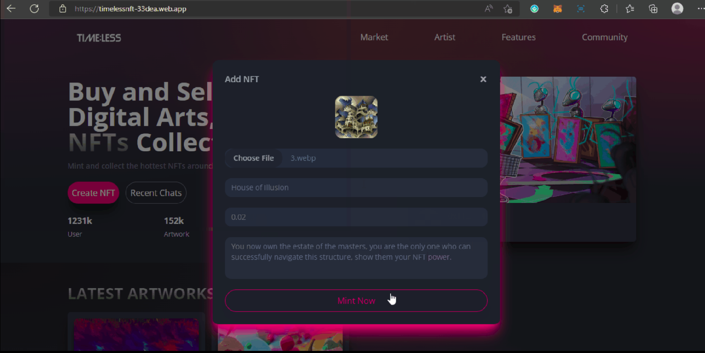
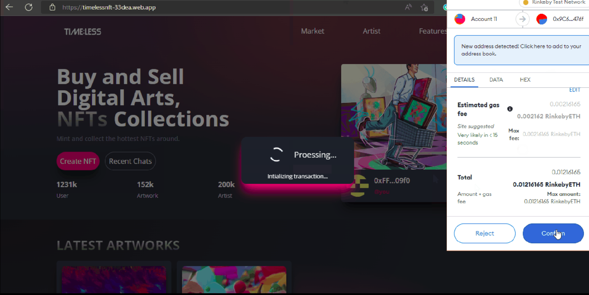
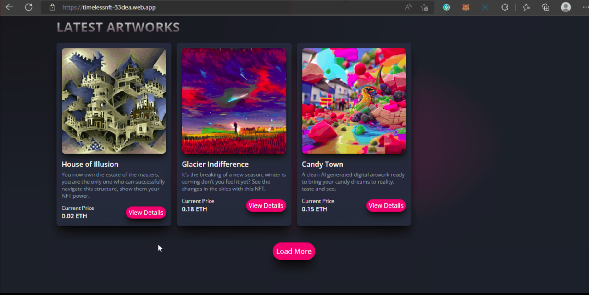
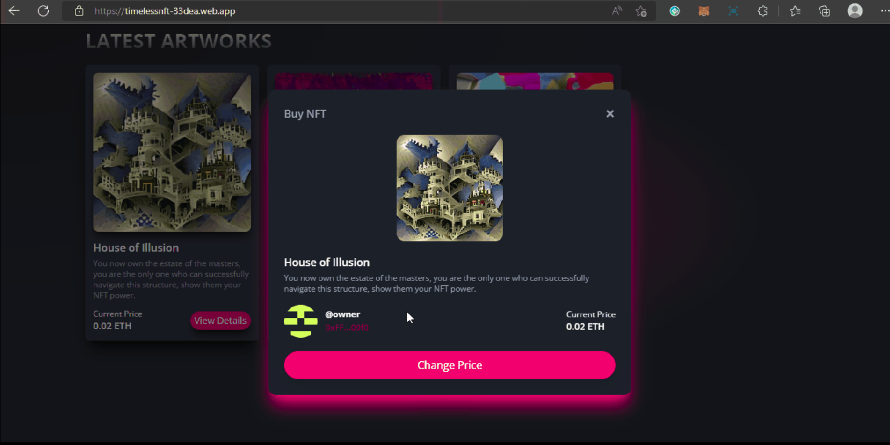

# Napft : NFT Trading platform

# Primary Technology Stack :
1. **react** `^17.0.2` : Primary Frontend Library
1. **tailwindcss** : Styling
1. **asiox** : Making HTTP API Calls
1. **ethers** : Interacting with Smart contracts
1. **react-hooks-global-state** : Simple State management
1. **web3** : Interacting with smart contracts
1. **yarn** : Package manager

# Links
1. **Frontend Github Repo** : [https://github.com/Mallikarjun362/napft-frontend](https://github.com/Mallikarjun362/napft-frontend)
1. **Backend Github Repo (Main)** : [https://github.com/Mallikarjun362/napft-main-backend](https://github.com/Mallikarjun362/napft-main-backend)
1. **Django Dackend Github Repo** : [https://github.com/Mallikarjun362/napft-django-backend](https://github.com/Mallikarjun362/napft-django-backend)
1. **Deployment** : [https://napft.vercel.app](https://napft.vercel.app/)

# Demo

